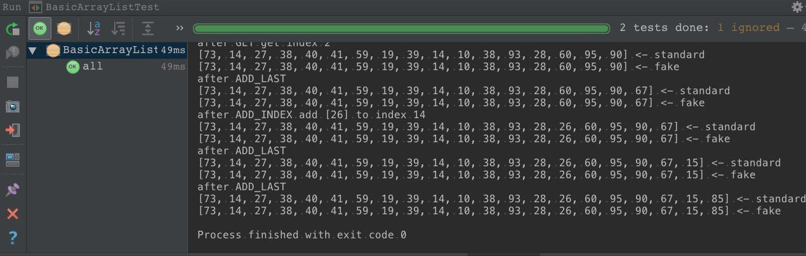

# basic-collection
java collection 的简单实现

## BasicArrayList
[BasicArrayList.java](src/main/java/com/study/collection/BasicArrayList.java)
大量参考了(或者说 copy 了?) jdk 中的 `ArrayList` 的源码,
也参考了 [LRH1993/android_interview 中的 arraylist.md](https://github.com/LRH1993/android_interview/blob/master/java/basis/arraylist.md) 等文章

为了简易起见, `BasicArrayList` 中只实现基本的增删改查功能.
具体如下
1. 增包括 `add(int)`, `add(int, E)`
2. 删只有 `remove(int)`
3. 改只有 `set(int, E)`
4. 查只有 `get(int)`

增删改查的功能在 [BasicArrayListTest.java](src/test/java/com/test/collection/BasicArrayListTest.java) 中进行了简单的测试.
该测试运行的示例如下图 

## BasicLinkedList
[BasicLinkedList.java](src/main/java/com/study/collection/BasicLinkedList.java)
大量参考了(或者说 copy 了?) jdk 中的 `LinkedList` 的源码,
也参考了 [LRH1993/android_interview 中的 linkedlist.md](https://github.com/LRH1993/android_interview/blob/master/java/basis/linkedlist.md) 等文章

为了简易起见, `BasicLinkedList` 中只实现基本的增删改查功能.
具体如下
1. 增包括 `add(int)`, `add(int, E)`
2. 删只有 `remove(int)`
3. 改只有 `set(int, E)`
4. 查只有 `get(int)`

增删改查的功能在 [BasicLinkedListTest.java](src/test/java/com/test/collection/BasicLinkedListTest.java) 中进行了简单的测试

